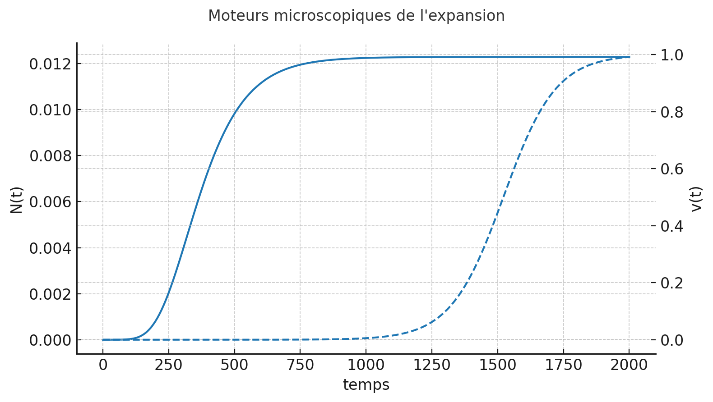

# Théorie sur gravité et expansion (25/n)

Réflexion durant 11s

")
")

Top — voilà un toy model qui illustre exactement ton scénario “émergence des grains” :

- On suppose que le nombre de grains $N(t)$ augmente vite au début (nucléation/percolation), puis se stabilise.
- Le volume par grain $v(t)$ croît rapidement pendant une courte phase (transition), puis tend vers une valeur stable
  $v_{max}$ (croissance logistique).
- Le volume total est $V(t)=N(t)v(t)$ et on définit un facteur d’échelle $a(t)∝V(t)^{1/3}$
  Sur les graphes :
- **a(t)** (figure 1) affiche une **montée explosive** au début lorsque $N(t)$ et $v(t)$ s’emballent, puis une sortie douce vers une expansion plus lente : c’est l’analogue d’une inflation suivie d’un régime standard.
- Le H(t) (figure 2) montre un pic initial (forte expansion), qui retombe ensuite.
- La figure 3 montre les **moteurs microscopiques** : $N(t)$ (création de grains) démarre très tôt et se sature ; $v(t)$ (gonflement d’un grain) accélère pendant la transition puis se stabilise.

Ce n’est qu’un jouet, mais il capture l’idée : **une transition de phase** où l’espace se **forme** (nucléation) et **gonfle** (croissance) peut produire une expansion initiale très rapide **sans violer** ta règle locale (le budget
c
c). Ensuite, quand la transition se termine, l’expansion ralentit — comme dans l’histoire ΛCDM (post-inflation).

Si tu veux, je peux :

- exporter ces courbes en **PDF/PNG** ou te fournir le **notebook** ;
- ajuster les paramètres pour que $a(t)$ et $H(t)$ ressemblent davantage à une courbe type inflation “quasi-exponentielle” sur une fenêtre courte ;
- ou remplacer ce modèle continu par une **simulation de percolation sur réseau** (nucléation + coalescence de domaines), pour coller encore plus à l’analogie “grains de riz qui s’organisent”.

> donc [qu'est-ce qu'il reste comme points à régler pour la cosmochronie](../26.md) ? On a réglé le bigbang/cmd mais est-ce qu'il y avait d'autres incompatibilités avec les observations connues ?
