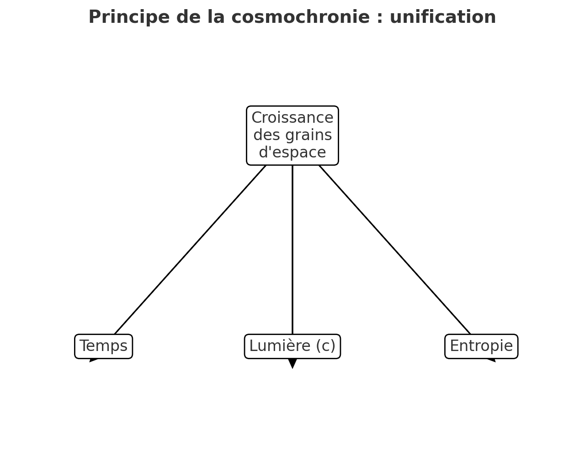

# Théorie sur gravité et expansion (30/n)

Voici un schéma simple : la **croissance des grains d’espace** est la source unique d’où émergent le **temps**, **la vitesse limite de la lumière** et **l’entropie**.

Veux-tu que je tente une version plus “physique”, avec des symboles (ΔV, c, S, t) et des équations sur le schéma, pour donner un aspect plus “article scientifique” ?

> [oui](../30/30.md)
