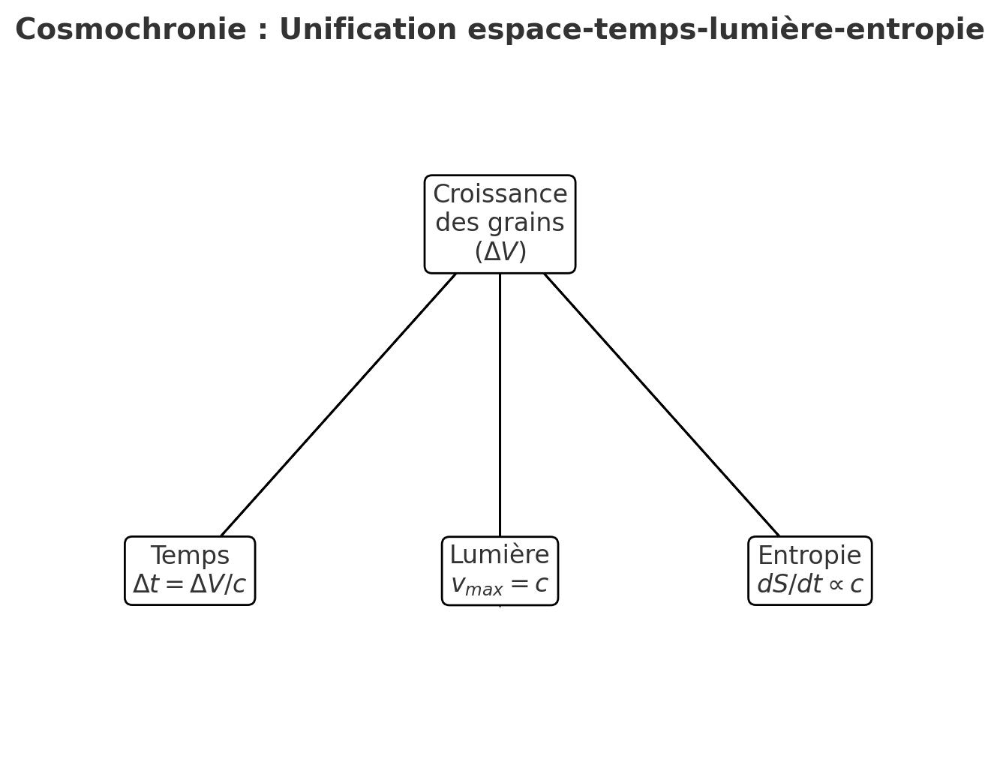

# Théorie sur gravité et expansion (30/n)

Voici la version plus “scientifique” :

- **ΔV** : croissance d’un grain d’espace
- **Δt** : perception du temps, liée à cette croissance
- **c** : vitesse limite, égale à la vitesse d’expansion locale
- **dS/dt** : entropie qui croît au rythme fixé par $c$/

Veux-tu que je développe aussi un **mini-formalisme mathématique** (genre équations différentielles simples) qui pose les bases de la cosmochronie ?

> [est-ce que les grains dont je parle pourraient être assimilés à la mousse quantique ?](../31-32-lqg-comparison/31/quantum-foam.md)
