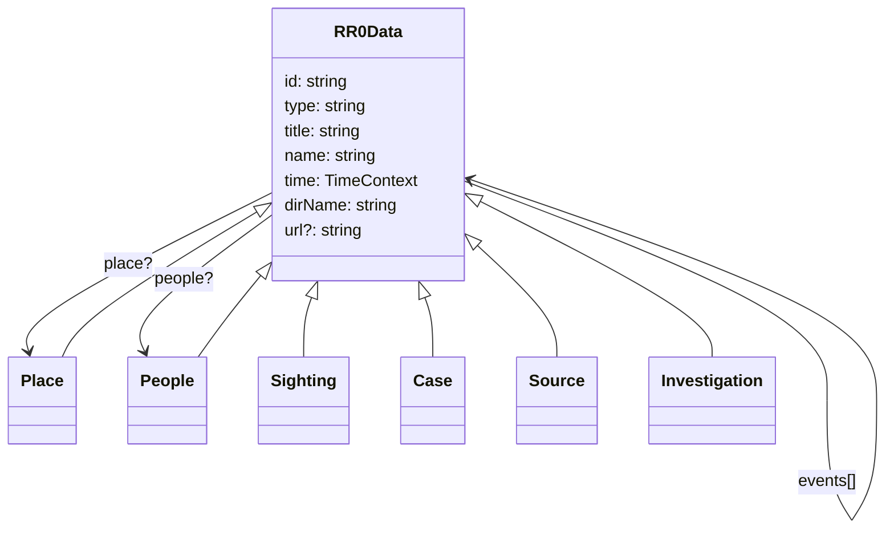

# Data

```mermaid
classDiagram
    class RR0Data {
        id: string
        type: string
        title: string
        name: string
        time: TimeContext
        dirName: string
        url?: string
    } 
    RR0Data --> Place: place?
    RR0Data --> People: people?
    RR0Data --> RR0Data: events[]
    class Sighting {
    }
    RR0Data <|-- Sighting
    class People {
    }
    RR0Data <|-- People
    class Place {
    }
    RR0Data <|-- Place
    class Case {
    }
    RR0Data <|-- Case
    class Source {
    }
    RR0Data <|-- Source
    class Investigation {
    }
    RR0Data <|-- Investigation
```
