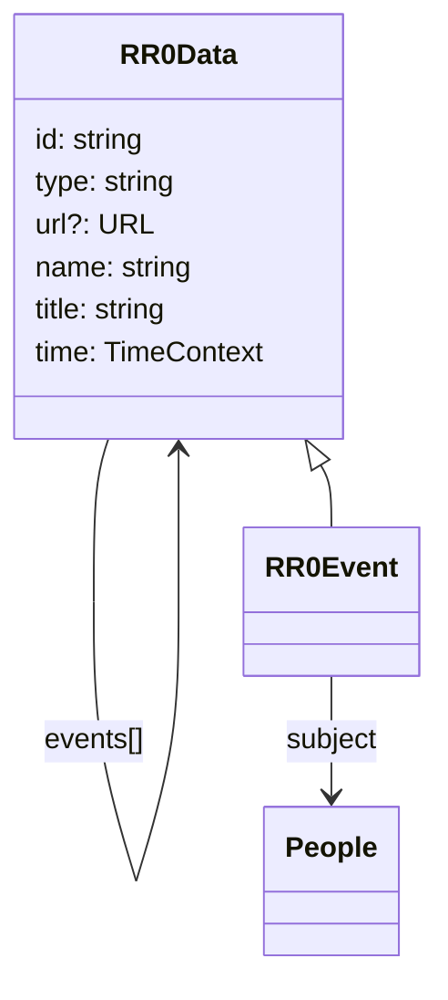

# RR0 Event

A RR0 event is a [RR0 Data](../data/README.md) with some people as a `subject`.

```mermaid
classDiagram
    class RR0Data {
        id: string
        type: string
        url?: URL
        name: string
        title: string
        time: TimeContext
    } 
    RR0Data --> RR0Data: events[]
    class RR0Event {
    }
    RR0Event --> People: subject
    RR0Data <|-- RR0Event
```
