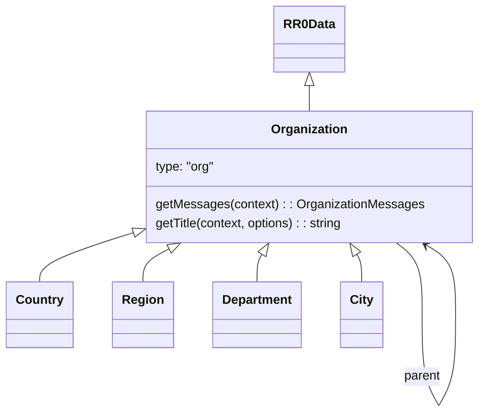
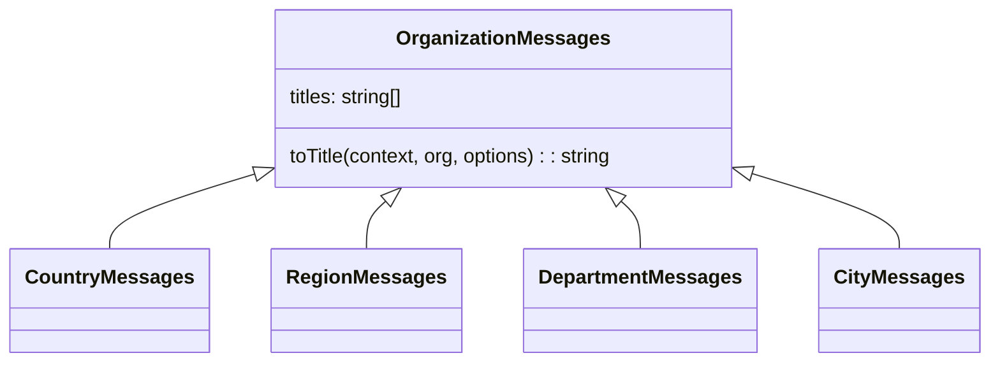

# Organizations

Organization are bureaucratic entities created by human.

Since they are usually hierarchical, they often reference a `parent` organization (a region references a country, etc.).

Organization may also refer to a place (a City for instance), but can reference several places.

## Messages

Organization-specific messages (how to mention an organization in a text using a given language, typically) can be obtained using the `getMessage(context)` method.

By default, this will use the `parent` link to build a fully descriptive organization name, by combining the organization name with its parent organizations names.

