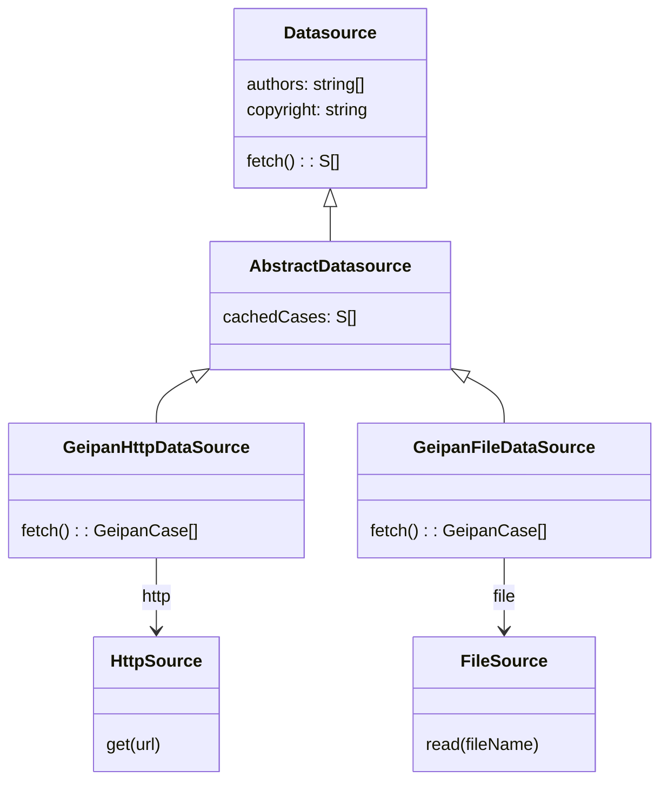

# RR0 timed data datasources

## Motivation

RR0 time data can be **imported** from external [Datasources](Datasource.ts), such as:

* Patrick Gross' website
    * [ACUFO](acufo)
    * [URECAT](urecat)
* [Base OVNI France](baseovnifrance)
* [Essex Police](essex-police)
* [FUFORA](fufora)
* [GEIPAN](geipan)
* [NUFORC](nuforc)
* [ufo-search](ufo-search)
* [RR0](rr0) itself, as static HTML to parse

## Analysis

An import is performed by setting up an `<ul>` tag replacement (for RR0 time pages) with a [ChronologyReplacerRefactory](ChronologyReplacerFactory.ts) which:

1. Fetches data
    - from the Web (using an [HttpSource](HttpSource.ts)), or
    - a (CSV) file.
1. Maps the data to a datasource-specific case
1. (optionally) saves the cases as a CSV file
1. Maps the datasource-specific case to a RR0 case.

## Design

